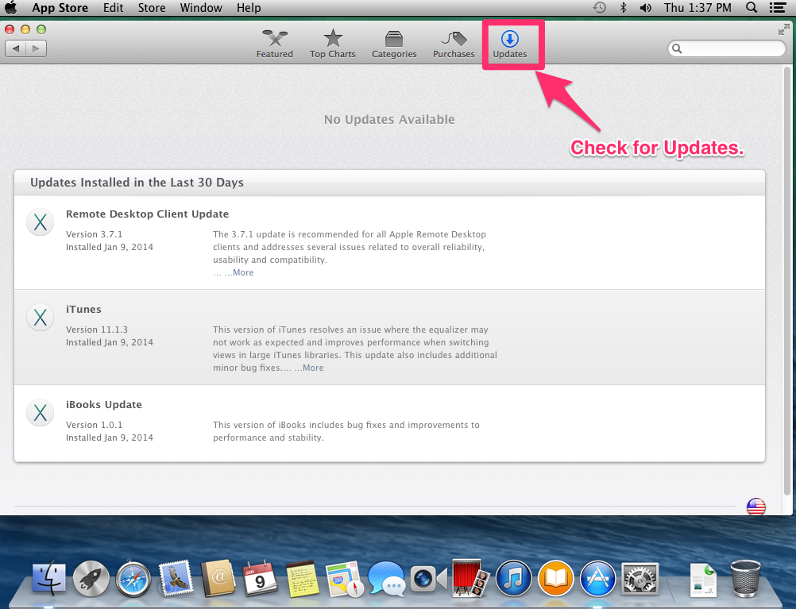

iOS-Development-Intro
=====================

Getting started with iOS Development
-----------------------------------

Requirements to get started:

1. Mac computer running OS X 10.7 (Lion) or later. Preferably OS X 10.9 (Mavericks).
2. Xcode 5
3. iOS SDK 7

[Apple's Setup Notes](https://developer.apple.com/library/ios/referencelibrary/GettingStarted/RoadMapiOS/index.html#//apple_ref/doc/uid/TP40011343)

Note - All requirements are free, with the exception of the Mac computer. The only drawback is you will not be able to run your App on a physical device until you register as an iOS Developer with Apple. This cost is currently $99/year.

To get started the simulator will work just fine.

Once you are all set and meet the requirements follow the steps below.

1. Check for OS X updates.

   It is best to make sure your OS X install is up to date.
   
   

2. Install Xcode 5 from the OS X App Store.
   
   
   * Xcode 5 is a little over 2GB download.
   * Xcode will be installed to: `/Applications/XCode.app`
3. Once the download is complete open XCode

[Lesson 1 - Hello World!](./images/hello-world/hello-world.md)

