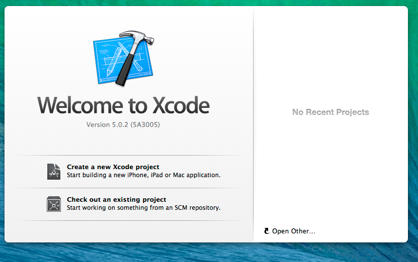
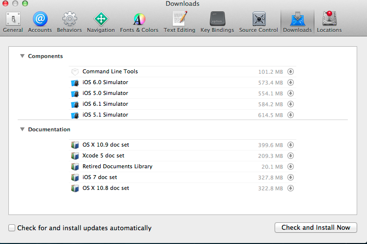
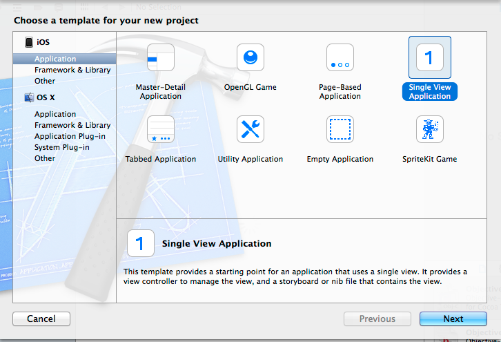
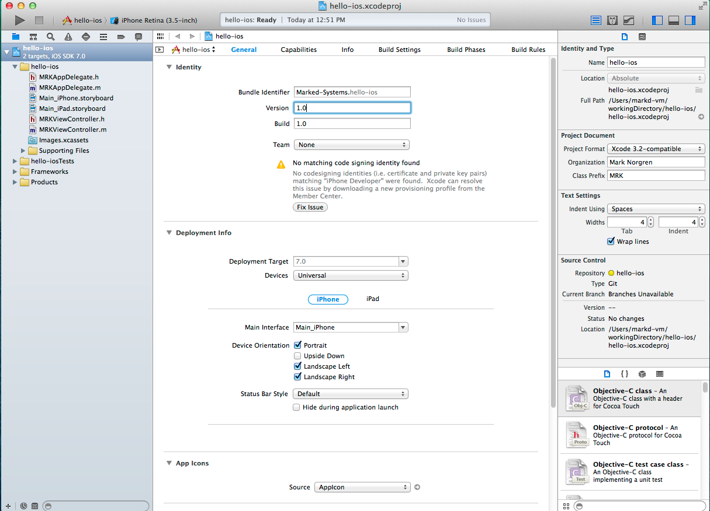
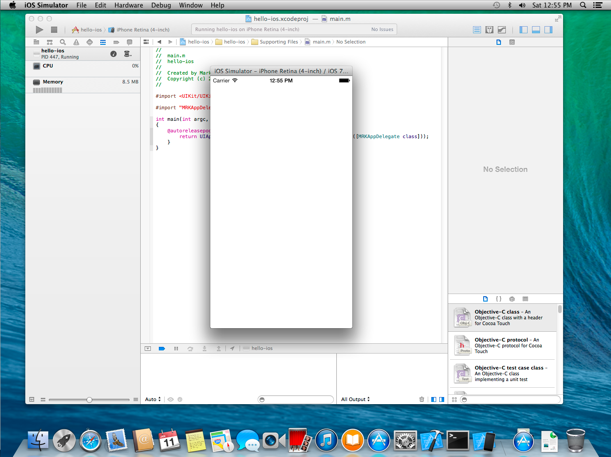
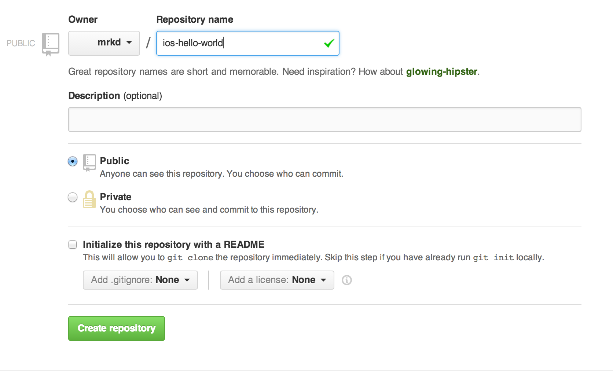

iOS-Development-Intro
=====================

Hello Xcode and iOS Development
-------------------------------

Now that XCode is installed on your Mac we can start with the Hello World for iOS Development. XCode makes this extremely easy for us.

1. Open XCode
   * You should see the 'Welcome to Xcode window'
   * Note if you are not running OS X 10.9 ()Mavericks) the 'command line tools' will 
   	 not be installed automatically for you. You will need to go to the menu bar 
	 under Xcode->Preferences and select the Downloads tab.
   * In the Components section click the download arrow to the right to install and download
     the Command Line Tools.
     
     
     
   
   
2. Click 'Create a new Xcode project'
3. Select the 'Single View Application' template for the new project.

   
4. Next will be the 'Choose options' window.
   * The 'Company Identifier' will be a part of your Application's 'Bundle Identifier'. The bundle identifier is almost like the executable's name, in that it tells iOS which application this is. If the bundle identifier changes and you install the app it is just like installing a whole new application.
   *  The class prefix is recommended to be 3 characters. Here I just chose 'MRK' for 'Mark'. This is Objective C's workaround for not having namespaces.
   * We will leave the devices selection as 'Universal' so the app will run on iPhone and iPad devices.
5. Next choose a location to save the project at. I usually create a `~/workingDirectory` to keep any projects I am actively developing.
   * Note: Leave the 'Create git repository on My Mac' checked. This will automatically setup the project
     directory as a git repo for us.
5. You should now have your new project in Xcode open. Press the Play button in the upper left of the window to build and run the project.

   
   
   * You may be prompted to enable developer mode on your Mac. Go ahead and Enable this.
   
6. Once your project builds Xcode will start the iOS simulator, install your app, and run it.
   * You should now see your application running in the simulator. For now this is simply a white window.
    

  

Push Project to Github
------------------------

* Note: If you prefer to use a GUI when working with Git I recommend using Atlassian's [SourceTree](http://www.sourcetreeapp.com/)

3. The root of your XCode project we created above should automatically have initialized a git repo for you. You can verify it did this by checking for the `.git` folder.
4. Run `git status` from the command line at the root of your project in terminal. This will show you files that are modified and need to be checked in.
5. Run `git add .`
   * this will add all modified files in the current directory and subdirectories.
6. Run `git commit -m "<type in meaninful commit meesge>"`
   * this will allow you to type a commit message and commit the files you staged in the previous step.
1. Create an account on [github.com](http://github.com) if you do not already have one.
2. Follow github's tutorial on generating ssh keys if you do not have ssh key's already setup.
   * [Generating ssh keys](https://help.github.com/articles/generating-ssh-keys)
2. Create a new repository and DO NOT initialize the repository with a README.
   * Note - name the repository 'xcode5-ios-hello-world' 
   

3. After creating the repository follow github's directions for adding this repo as a remote repository and push your code to it.

Links / References
------------------

* [iOS UIViewController Lifecycle](http://rdkw.wordpress.com/2013/02/24/ios-uiviewcontroller-lifecycle/)

